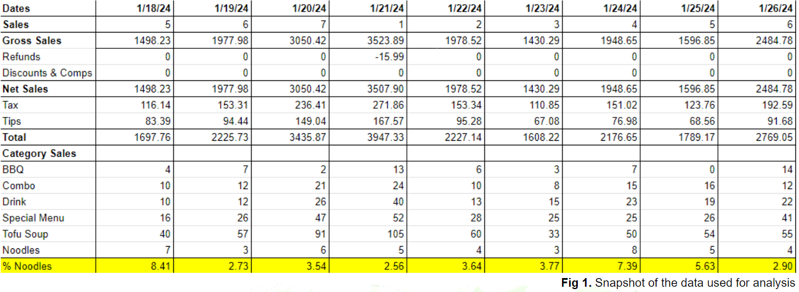
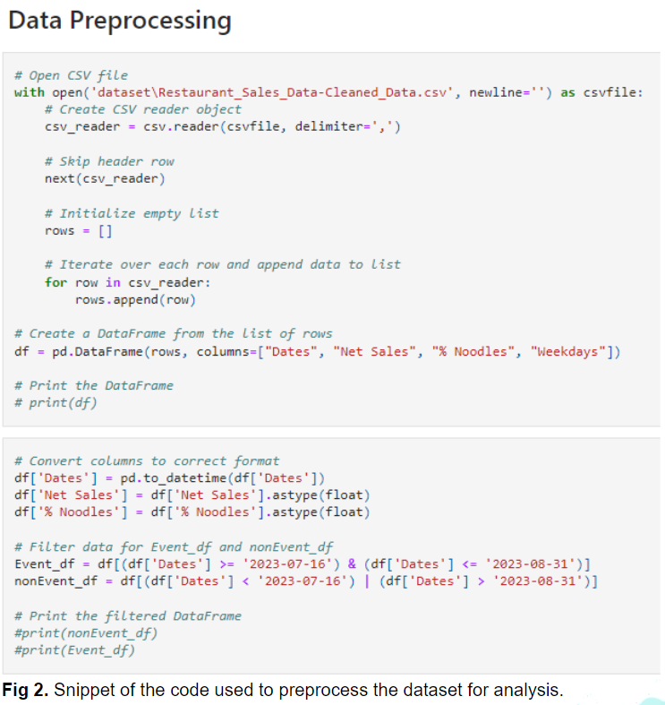
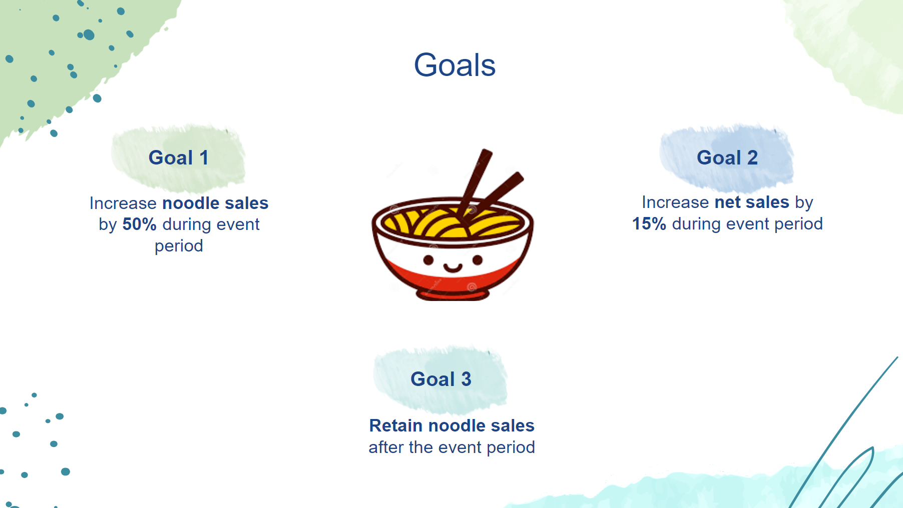
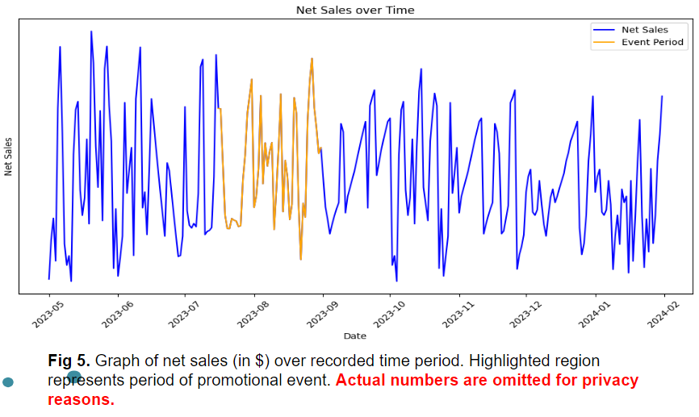
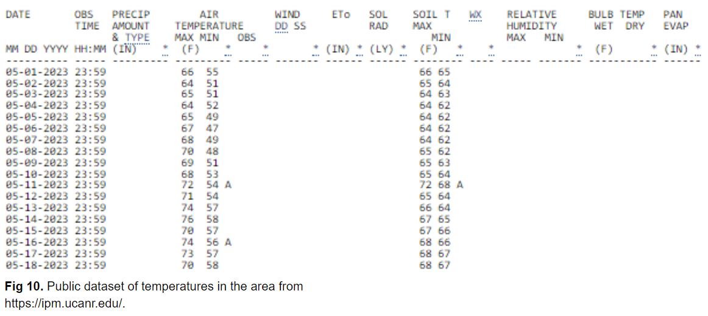
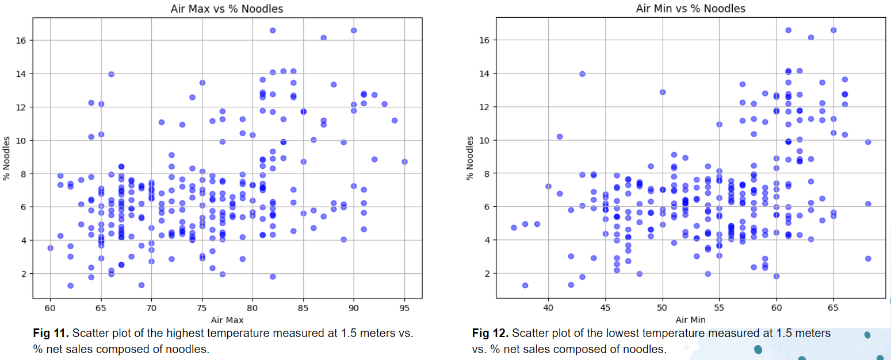
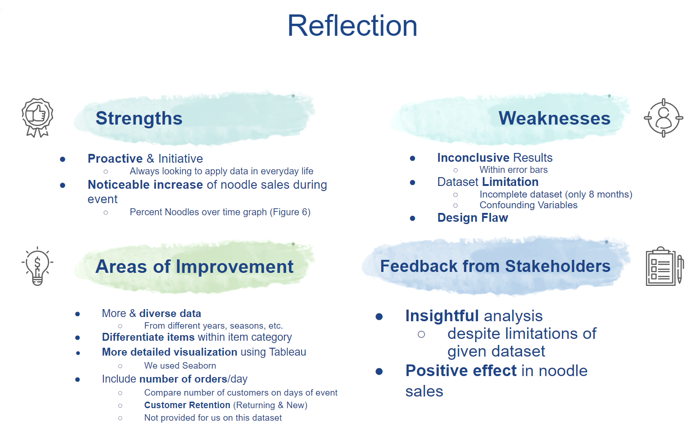

# Restaurant Promotional Event

## Motivation

Hi everyone, welcome to our <strong>Restaurant Promotional Event</strong> project. We are Sean and Jeff, twin brothers with a passion for data science. This is the first of our many data science projects to come in the future.

We stumbled upon this project while we were working on another data science project together. I was teaching Jeff how to use machine learning algorithms to get desirable test results on synthesized datasets. We were still playing around with the ML models when we decided that it would be much more exciting to use real-life datasets to perform data analysis and to build machine learning models. 

We came up with the idea of holding a promotional event for the restaurant I had a part-time job at. Then, we would utilize the data gathered from the event period to perform data analysis to measure the effectiveness of the event. We were fortunate because the owners are actually family friends, and I unusually just helped them out whenever they needed shifts to be filled in. I proposed the idea to them, and they were more than happy to collaborate. We quickly came up with a promotional event offering a free drink with every noodle sale for the event period of 7/16 to 8/31. 

---
## Table of Contents

  ### <li><a href="#goals">1. Goals</a></li>
  ### <li><a href="#timeline">2. Timeline</a></li>
  ### <li><a href="#data-analysis">3. Data Analysis</a></li>
  ### <li><a href="#results">4. Results</a></li>
  ### <li><a href="#possible-confounding-variable">5. Possible Confounding Variable</a></li>
  ### <li><a href="#reflection">6. Reflection</a></li>
</ul>

## 
1. Goals

The project was driven by three primary objectives aimed at enhancing our restaurant's performance. We primarily aimed to amplify restaurant sales and ensure a positive impact on overall revenue through the promotional event. Our focus was also on elevating noodle sales and introducing our enticing entree to a wider audience, thus diversifying our customer base. Most importantly, we aimed to sustain this growth post-event by fostering customer loyalty and enticing repeat orders rather than merely boosting noodle sales temporarily.

---
## 
2. Timeline

June of 2023 was when Sean presented his proposal to the restaurant owner,a longstanding family friend. The owner was very delighted with the idea and approved the usage of a portion of the sales data. We started with using the data collected from May of 2023. The promotional event lasted from mid-July until the end of August that year, but the data was collected until January 2024.
 

---
## 
3. Data Analysis

The data was gathered and used only in the most generalized format, as shown here. This was for both security and privacy reasons and was requested by the restaurant owner. A snapshot of the dataset used is shown here:

The data was organized using Excel and then SQL to join and manipulate the table accordingly, such as dropping null/invalid values and joining the temperature dataset to the table. Then, the data was preprocessed using Python and its libraries. The code is shown here:

The data collection process was the longest, and took 8 months, while the analysis portion only took around 1 to 2 days total. Results and statistical insights were presented to the two stakeholders, the restaurant owner and the manager.

---
## 
4. Results

The outcomes of our promotional event unveiled a mixed bag of surprises and disappointments. Despite witnessing a remarkable 81.13% surge in noodle sales, our anticipation for a parallel spike in net sales, commensurate with the noodle sales surge, was met with a mere 7.18% increase. This discrepancy between the robust increase in noodle sales and the lackluster growth in net sales confounded our initial expectations.

Further analysis revealed that while noodle sales experienced a substantial boost exclusively during the event period, the pre- and post-promotion phases demonstrated negligible differences. This temporal pattern suggested that the promotional event itself acted as the primary catalyst for the surge in noodle sales, rather than any sustained, long-term effects on consumer behavior.

Curiously, despite the significant increase in noodle sales during the event, there were no discernible visual differences in net sales over time, with all results consistently falling within the margins of error. This observation underscored the complexity of the factors influencing overall net sales performance, which appeared impervious to the fluctuations in noodle sales.
 

This discrepancy between the remarkable spike in noodle sales and the lack of corresponding growth in net sales prompts a deeper examination into the underlying dynamics at play. It compels us to scrutinize not only the immediate impacts of promotional events but also the enduring effects, or lack thereof, on overall revenue generation and customer retention strategies. As we navigate these insights, we remain poised to recalibrate our promotional strategies and refine our understanding of customer preferences to drive sustained, holistic growth in the future.

---
## 
5. Possible Confounding Variable
  
While our analysis indicated a successful increase in noodle sales during the promotional event, we remained vigilant in exploring potential contributing factors beyond the event itself. One factor that piqued our interest was temperature. Considering that our noodles were served cold, we hypothesized that higher temperatures might have influenced customers to opt for the refreshing option of cold noodles over hotter alternatives like steaming tofu soup.

Drawing on data sourced from /ipm.ucanr.edu, we conducted a correlation analysis between noodle sales percentages and maximum air temperatures. Surprisingly, our findings revealed a positive correlation between these variables, suggesting that warmer temperatures indeed coincided with heightened noodle sales. This correlation underscored the nuanced interplay between environmental factors and consumer behavior, shedding light on additional dynamics influencing our sales outcomes.

---
## 
6. Reflection

The 3 goals set prior to the event must be evaluated first to measure the success of the promotion. Goal 1 was met successfully because the noodle sales increased by 81.13% during the time of our event. This easily surpasses the 50% increase goal we set in the beginning. We can safely conclude that our noodle entrees were able to reach a wider audience from this promotion.
 
Unfortunately, Goal 2 was not successfully met because the net sales only increased by **7.18%**. However, this wasn’t a complete failure because there were very important takeaways from this project that may be useful in the future. Upon deeper analysis, it must be considered that the **noodles are also entrees**. This means that noodles would be replacing the soondubu (Korean tofu soup) for each customer. Taking into account that the price of noodle dishes were only **8-10% more expensive** than what it is effectively replacing and minus the price of free drinks, the result is as expected. For more drastic effects, *it should have been a side dish that was promoted*. Everyone gets an entree, but only a part of them also purchases a side dish. By promoting a semi-popular side dish that is moderately priced, the **business can maximize its promotional effects and also revenue at the same time**.
 
Despite the initial success in skyrocketing noodle sales during our promotional events, Goal 3 proved elusive as sales sharply declined post-event, mirroring the graph depicting the percentage of noodle sales and the total number of noodles sold each day. This decline highlighted the transient nature of the sales surge, tied closely to the event's duration. The inability to sustain momentum post-event underscored the challenge of retaining customer interest and engagement over the long term. Moving forward, we recognize the imperative of strategies that cultivate enduring customer loyalty, emphasizing the need for more comprehensive approaches to achieve our objectives.

Other than these items mentioned, there were also many other points that could be improved in the future. Most importantly, there was a clear limitation in the dataset we were working with. We may have been able to achieve more insightful conclusions with a larger dataset spanning over a couple of years. Such a dataset would have been ideal because we would have been able to test the seasonality of the sales and also compare the dataset with data from different years. However, the restaurant was relatively newly opened at the time of the data collection, and this will take a very long time to achieve. 
 
Many outliers also produced inconclusive results. Graphs had very large and overlapping error bars caused by the many and frequent outliers. Including analysis of weekdays may have helped minimize the number of outliers because there are certain days of the week that consistently have more sales than others. But we concluded that it would have minimal effect in the long run, and decided not to include them.
  
All in all, the stakeholders were very pleased with the results and insights we were able to gain from this project. We plan on revisiting this project sometime in the future when there is more dataset and with a more improved event design.

